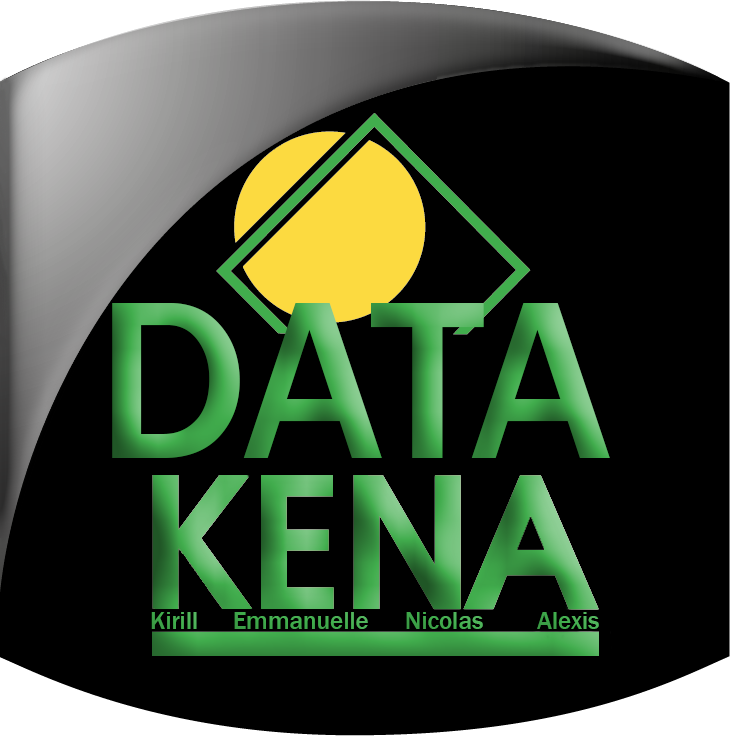

#  :tokyo_tower: Data_Kena :statue_of_liberty:

Projet réalisé à partir de la base de données open source proposée par ADN Tourisme.

Projet réalisé en 6 semaines en équipe de 4 personnes.

##
## Sujet :
ADN Tourisme, Fédération nationale des organismes institutionnels de tourisme, nous mandate afin de réaliser un audit de sa base de données, et en particulier de la catégorisation des 450.000 établissements recensés dans la base.

##
## Réponse et outils utilisés :
Nous y avons répondu en proposant 3 outils :
* Une carte interactive recensant l'ensemble des établissements et fournissant des données sur chacun d'entre eux.
* Un tableau permettant de filtrer et classer les établissements selon différents critères et avec une colonne Catégorie initiale et une colonne Catégorie prédite par notre algorithme.
* Un chatbot permettant de rentrer la description d'un nouvel établissement et de se voir proposer sa classification.

différentes **visualisations**, à la fois de la base de données mais également de statistiques INSEE de la Creuse.  
Nous avons ensuite généré un outil permettant au cinéma de trouver des sujets destinés à proposer des **semaines thématiques** à ses clients,  
Puis 2 **moteurs de recommandations**, un concernant les films et l'autre uniquement pour les documentaires : via **streamlit**, le client rentre un film/documentaire de son choix et l'algorithme lui propose les plus **proches voisins** de ce film/documentaire.  
Nous avons également proposé en page d'accueil un espace d'**inscription à une newsletter** qui envoie automatiquement un mail au cinéma dès qu'une inscription est faite et qui génère automatiquement un tableau au format CSV contenant les noms et adresses mail des clients inscrits.

La présentation a été réalisée via le logiciel **Canva**.  

##
## Les éléments importants :
* [La présentation CANVA convertie au format PDF](https://github.com/Datalex0/Cine-Metrics-Consulting/blob/65ed30dd3aa2a27c1ee258f2b5a9af30fe2670d9/SRC/CINE%20METRICS%20CONSULTING.pdf) 
* Le code (en python)
* Les fichiers CSV
* [Le lien vers la démonstration Streamlit](https://cine-metrics-consulting.streamlit.app)
* [Le logo d'équipe](SRC/logo.png)

## Lien vers la présentation :
* [Le lien vers la démonstration Streamlit](https://data-kena.streamlit.app/)
